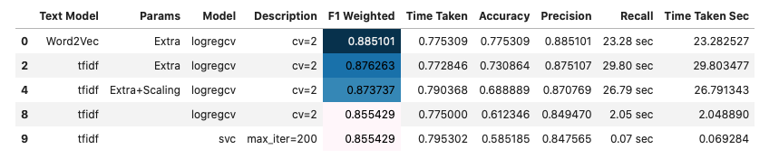
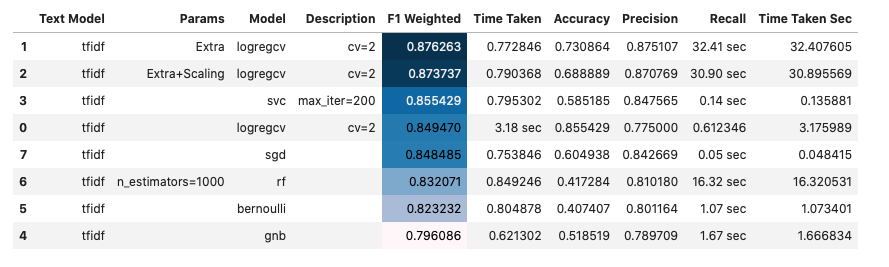

# Introduction
In this project, I took the data from [Analytics Vidhya Hackathon: Identify the sentiments](https://datahack.analyticsvidhya.com/contest/all/). This is an online competition platform for data science projects and in this NLP project I achieved the position on 12th among thousands of participants.

```
Example tweet:
#fingerprint #Pregnancy Test https://goo.gl/h1MfQV #android #apps #beautiful #cute #health #igers #iphoneonly #iphonesia #iphone

Cleaned text:
fingerprint pregnancy test android aps beautiful cute health igers iphoneonly iphonesia iphone

hashtags:
#fingerprint #Pregnancy #android #apps #beautiful #cute #health #igers #iphoneonly #iphonesia #iphone


We have 7920 training tweets.
We also have 1953 test tweets without label. (we need to upload the test predictions to get the weighted F1 score.)
```

# Model Comparisons
|Notebook  | Valid F1| Test F1  |
| :---| :---: | ---: |
| b01_sentiment_analysis_modelling_bow_word2vec_tfidf | 0.885101 |  |
| b02_sentiment_analysis_modelling_tfidf | 0.876263 |  |
| --- | --- | --- |
| c01_sentiment_analysis_ktrain | 0.88  |  |
| c01b_sentiment_analysis_ktrain_neptune |0.924609  | 0.907575 |
| c01c_sentiment_analysis_ktrain_neptune_hpo | 0.917368 | 0.877973  |
|c02_sentiment_analysis_simpletransformers_wandb_roberta_full_data  |  |  |
|---  |---  | --- |
| d01_sentiment_analysis_keras_lstm | 0.860 | 0.83785 |
| d02_sentiment_analysis_keras_gru_gbru | 0.871895 |  |
|---  | --- |---  |
|e01_sentiment_analysis_small_data_transformers_distilbert_torch  | 0.9120 |  |
| e02_sentiment_analysis_transformers_distilbert_keras | 0.663583 |  |
| e03_sentiment_analysis_bert_tf2 | 0.884748 |  |
| e03b_sentiment_analysis_bert_tf2_neptune | 0.8787 |  |


# Text Analysis and Visualization
- First do data cleaning.
- PCA plot. (dimension reduction)
- Most frequent words for positive and negative sentiment tweets.
- Wordcloud
- Treemap
- kde plots for +ve and -ve sentiments for new added features.
- n-grams

# Classical Methods
- We need data cleaning and feature creation.
- Embedding: BoW (CountVectorizer), TF-IDF, Word2Vec
- Algorithms: LogisticRegression, LinearSVC.




# Deep Learning: LSTM, GRU
- First we do text processing.
- Prepare data using keras text processing tools `Tokenizer` and `sequence`.
- Keras sequential model using LSTM
- Keras sequential model using GRU


# Advanced method: Using module ktrain
- We don't need data cleaning.

- supports `'fasttext' 'nbsvm' 'logreg'  'bigru'  'bert' 'distilbert'`.

```python
(X_train, y_train), (X_valid, y_valid), preproc = \
ktrain.text.texts_from_df(df_train,
    text_column=maincol,
    label_columns=[target],
    random_state=SEED,
    ngram_range=1,
    max_features=20000,
    val_df = None, # if not 10% of train is used
    maxlen=500,
    preprocess_mode='bert')

model = ktrain.text.text_classifier(name='bert',
                             train_data=(X_train, y_train),
                             metrics=['accuracy'],
                             preproc=preproc)

learner = ktrain.get_learner(model=model,
                             train_data=(X_train, y_train),
                             val_data=(X_valid, y_valid),
                             batch_size=6)


predictor = ktrain.get_predictor(learner.model, preproc)
test_preds = predictor.predict(X_test,return_proba=False)

best_so_far = """
bert lr=2e-5 epochs=5 ngram_range=1 maxlen=300
f1 = 0.908687336005899

n_gram=2 gave worse result
tweet_clean_emoji gave worse result

bert lr=2e-5 epochs=5 ngram_range=1 maxlen=400
f1 = 0.908265806079951

bert lr=2e-5 epochs=5 ngram_range=1 maxlen=300 maincol=tweet_clean
f1=0.877973006703751

"""
```

## Advanced Method: Using module simpletransformers

```python
from simpletransformers.classification import ClassificationModel

model_type = 'xlnet'
model_name = 'xlnet-base-cased'

model = ClassificationModel(model_type, model_name, args=train_args)
model.train_model(df_train, eval_df=None)

test_preds, _, = model.predict(df_test['tweet'].to_numpy())
```
